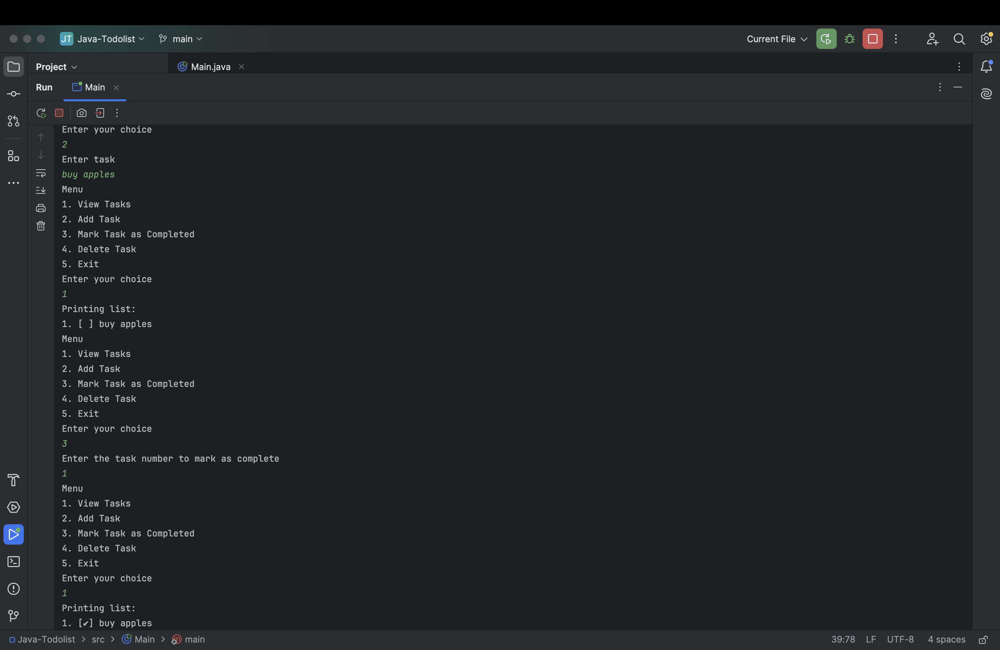

# Java To-Do List Application

A simple command-line To-Do list application built with Java. This application allows users to add tasks, mark them as completed, delete tasks, and view the list of tasks.

---

## 📸 Screenshot



---

## Features

- **View Tasks**: Display all the tasks in the list.
- **Add Task**: Add new tasks to the To-Do list.
- **Mark Task as Completed**: Mark tasks as completed by changing their status.
- **Delete Task**: Remove tasks from the list.
- **Exit**: Exit the application.

---

## 🧱 Built With

- Java
- Scanner for input
- ArrayList for task storage

---
## Prerequisites

Before running the application, ensure you have the following installed:

- **Java 8 or later** (The code was developed and tested with Java 8)
  
You can download and install Java from the official website:  
[Download Java](https://www.oracle.com/java/technologies/javase-jdk14-downloads.html)

---

## 🧑‍💻 How to Run

1. Clone the repository or copy the `Main.java` file.
2. Compile the code:
   ```bash
   javac Main.java
   ```
3. Run the application:
   ```bash
   java Main
   ```

---

## ✅ Example Output

```
Menu  
1. View Tasks  
2. Add Task  
3. Mark Task as Completed  
4. Delete Task  
5. Exit  
Enter your choice:
```

### Option 1: View Tasks  
Displays the current list of tasks along with their status.

### Option 2: Add Task  
Allows you to enter a new task that will be added to the To-Do list.

### Option 3: Mark Task as Completed  
Prompts you to enter the task number you wish to mark as completed.  
It will change the status from `[ ]` to `[✔]`.

### Option 4: Delete Task  
Prompts you to enter the task number you wish to delete from the list.

### Option 5: Exit  
Exits the application.

---

# License

This project is licensed under the MIT License - see the `LICENSE.md` file for details.

---

# Contributing

1. Fork the repository.  
2. Create a new branch:  
   ```bash
   git checkout -b feature-name
   ```
3. Make your changes and commit them:  
   ```bash
   git commit -am 'Add new feature'
   ```
4. Push to the branch:  
   ```bash
   git push origin feature-name
   ```
5. Open a pull request.

---

## 🙋‍♀️ Author

Created by a Java enthusiast 💻✨
For any issues or inquiries, feel free to contact me at:

- **Email:** mrymfa96@gmail.com
- **GitHub:** [MasoumehF](https://github.com/MasoumehF)